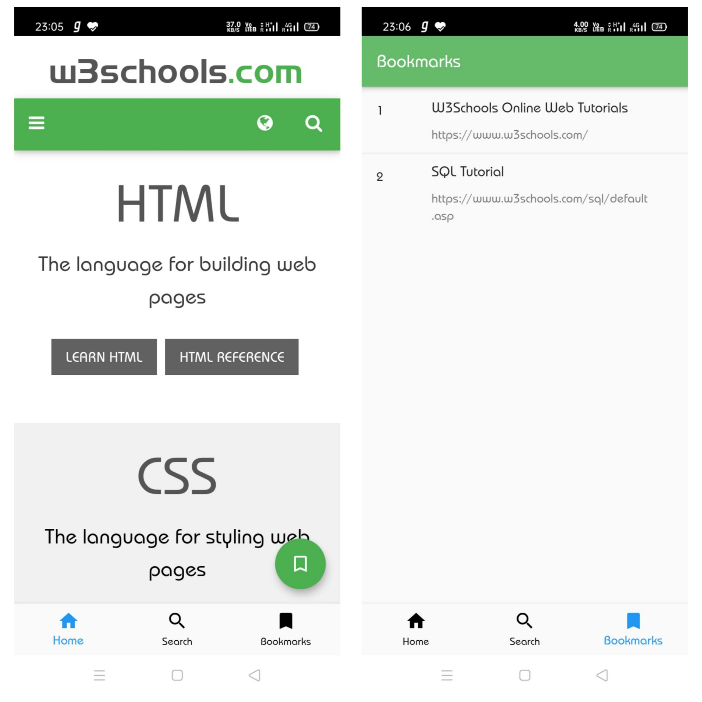
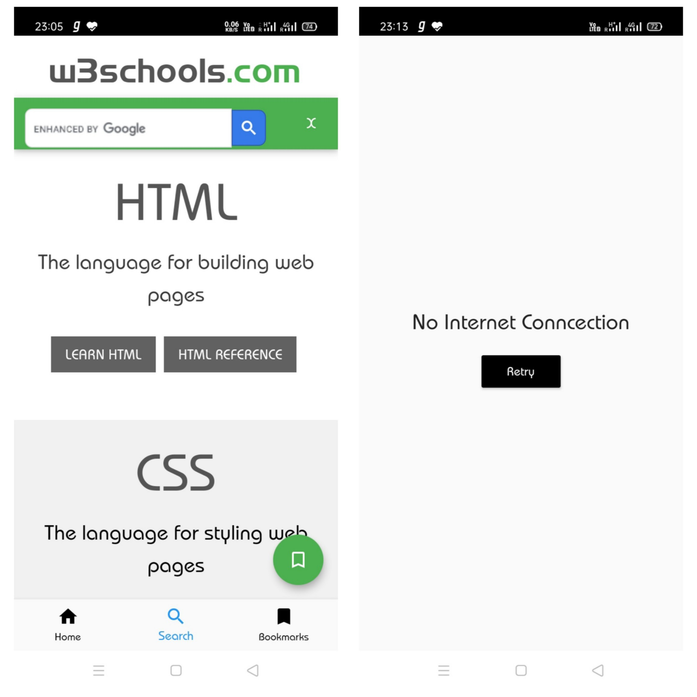

<!-- PROJECT SHIELDS -->
<!--
*** I'm using markdown "reference style" links for readability.
*** Reference links are enclosed in brackets [ ] instead of parentheses ( ).
*** See the bottom of this document for the declaration of the reference variables
*** for contributors-url, forks-url, etc. This is an optional, concise syntax you may use.
*** https://www.markdownguide.org/basic-syntax/#reference-style-links
-->

   

<!-- PROJECT LOGO -->
 

  

  <h3 align="center">W3Schools Unofficial Android Application</h3>

<!-- TABLE OF CONTENTS -->
## Table of Contents

* [About the Project](#about-the-project)
  * [Built With](#built-with)
* [Contact](#contact)
* [Acknowledgements](#acknowledgements)

<!-- ABOUT THE PROJECT -->
## About The Project

This is the unofficial app for the most popular website to learn web development [w3schools](https://w3schools.com/).

##### Features

1. Ad Free
2. Bookmarks

### Built With
* [Dart](https://dart.dev)
* [Flutter](https://flutter.dev)

<!-- CONTACT -->

## Contact

Shashikant Dwivedi - [@theskd1999](https://twitter.com/theskd1999) - shashikant@shashikantdwivedi.com

Project Link: [w3schools](https://github.com/shashikantdwivedi/w3school)

<!-- ACKNOWLEDGEMENTS -->
## Acknowledgements
* [webview_flutter](https://pub.dev/packages/webview_flutter)
* [provider](https://pub.dev/packages/provider)
* [hive](https://pub.dev/packages/hive)
* [hive_flutter](https://pub.dev/packages/hive_flutter)
* [path_provider](https://pub.dev/packages/path_provider)
* [intl](https://pub.dev/packages/intl)
* [data_connection_checker](https://pub.dev/packages/data_connection_checker)
* [hive_generator](https://pub.dev/packages/hive_generator)
